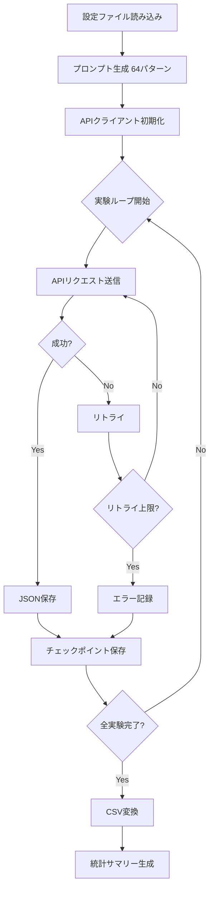

# 実験方法論

## 概要

本文書は、LLM地域観光紹介性能比較実験の方法論を詳述します。本研究は、大規模言語モデル（Large Language Model, LLM）の観光情報生成能力を体系的に評価するための実験デザイン、データ収集手順、倫理的配慮を含む包括的な方法論を提供します。

**最終更新日**: 2025-01-21
**バージョン**: 1.0.0
**ライセンス**: CC BY 4.0

---

## 1. 研究デザイン

### 1.1 研究目的

本研究の主要な目的は以下の通りです：

1. **性能比較**: 4種類のLLMの観光情報生成能力を定量的・定性的に比較評価する
2. **ペルソナ影響**: ペルソナ設定が生成テキストの特性に与える影響を分析する
3. **ターゲット適応**: 異なる旅行タイプに対する応答の適応性を評価する
4. **再現性確保**: オープンサイエンスの原則に基づき、完全に再現可能な実験環境を構築する

### 1.2 実験デザイン（3元配置デザイン）

本研究は、3つの独立変数を持つ完全要因デザイン（Full Factorial Design）を採用します：

| 要因 | 水準数 | 水準内容 |
|------|--------|----------|
| **モデル** | 4 | GPT-5.1, Claude Sonnet 4.5, Gemini 2.5 Flash, Grok-4 Fast |
| **ペルソナ** | 4 | 旅行代理店、YouTuber、自治体職員、インフルエンサー |
| **旅行タイプ** | 4 | 家族、カップル、外国人、シニア |

**総実験数**: 4 × 4 × 4 = **64パターン**

### 1.3 対象地域

**研究対象地域**: 山口県下関市

**選定理由**:
- 歴史的観光資源と自然景観の両方を有する
- 海峡、温泉、歴史遺産、地域グルメなど多様な観光資源
- 国内外の観光客層の多様性
- 中規模都市として汎用性の高い知見が得られる

---

## 2. データ収集手順

### 2.1 プロンプト設計

#### 2.1.1 テンプレート構造

```
あなたは{ペルソナ}です。下関の観光名所を紹介してください。
紹介相手は、{旅行タイプ}を計画しています。1000文字程度で要約してください。
```

#### 2.1.2 設計原則

1. **簡潔性**: 追加の文脈を最小限にし、モデルの本質的な能力を測定
2. **標準化**: すべての実験で同一テンプレートを使用
3. **明確性**: 役割（ペルソナ）とターゲット（旅行タイプ）を明示
4. **制約条件**: 文字数制約（約1000文字）を設定し、要約能力を評価

### 2.2 API設定

#### 2.2.1 共通パラメータ

| パラメータ | 設定値 | 理由 |
|-----------|--------|------|
| `temperature` | 0.7 | 創造性と一貫性のバランス |
| `max_tokens` | 2000 | 十分な応答長を確保 |
| `top_p` | 0.9 | 多様性を保ちつつ品質維持 |
| `frequency_penalty` | 0.0 | デフォルト値（バイアス排除） |
| `presence_penalty` | 0.0 | デフォルト値（バイアス排除） |

#### 2.2.2 実行制御

- **リクエスト間隔**: 2秒（レート制限対策）
- **タイムアウト**: 60秒
- **リトライ回数**: 最大3回（指数バックオフ）
- **エラーハンドリング**: すべてのエラーをログに記録

### 2.3 データ収集プロセス



### 2.4 保存データ構造

#### 2.4.1 生データ（JSON）

```json
{
  "session_id": "session_20250121_143022",
  "experiment_id": "exp_000",
  "timestamp": "2025-01-21T14:30:22.123456+09:00",
  "model": {
    "name": "openai/gpt-5.1-chat",
    "display_name": "OpenAI GPT-5.1"
  },
  "persona": {
    "id": "travel_agent",
    "name": "旅行代理店スタッフ"
  },
  "travel_type": {
    "id": "family",
    "name": "家族旅行"
  },
  "prompt": "あなたは旅行代理店スタッフです...",
  "response": "下関は...",
  "performance": {
    "tokens_used": 1234,
    "latency_ms": 2345
  },
  "metadata": { ... },
  "api_parameters": { ... }
}
```

#### 2.4.2 処理済みデータ（CSV）

| カラム名 | データ型 | 説明 |
|----------|----------|------|
| `session_id` | string | セッション識別子 |
| `experiment_id` | string | 実験識別子 |
| `timestamp` | datetime | 実行日時（ISO 8601） |
| `model` | string | モデル名 |
| `persona_name` | string | ペルソナ名 |
| `travel_type_name` | string | 旅行タイプ名 |
| `prompt` | text | 入力プロンプト |
| `response` | text | 生成テキスト |
| `tokens_used` | integer | 使用トークン数 |
| `latency_ms` | integer | 応答時間（ミリ秒） |
| `response_char_count` | integer | 文字数 |

---

## 3. 分析手法

### 3.1 定量分析

#### 3.1.1 基礎統計量

- **文字数**: 平均、標準偏差、最小値、最大値
- **トークン数**: モデル間の効率性比較
- **応答時間**: 性能評価指標
- **文構造**: 句読点数、段落数

#### 3.1.2 テキスト類似度分析

**手法**: Sentence Transformers（多言語対応モデル）

```python
from sentence_transformers import SentenceTransformer
model = SentenceTransformer('paraphrase-multilingual-mpnet-base-v2')
```

**分析内容**:
- 同一条件下での異なるモデル間の類似度
- 同一モデルの異なるペルソナ間の類似度
- クラスタリング分析（階層的クラスタリング）

#### 3.1.3 感情分析

**手法**: 日本語BERTモデル

```python
from transformers import AutoModelForSequenceClassification, AutoTokenizer
model = AutoModelForSequenceClassification.from_pretrained(
    'cl-tohoku/bert-base-japanese-whole-word-masking'
)
```

**評価指標**:
- ポジティブ/ネガティブ極性
- 感情の強度
- ペルソナ別の感情表現傾向

### 3.2 定性分析

#### 3.2.1 内容分析

- **情報の正確性**: 事実関係の検証
- **情報の網羅性**: 言及された観光資源の種類と数
- **表現の適切性**: ペルソナとターゲットの整合性
- **創造性**: ユニークな表現や提案の有無

#### 3.2.2 評価基準

| 観点 | 評価基準 |
|------|----------|
| **正確性** | 地名、施設名、歴史的事実の正確性 |
| **網羅性** | 観光スポット、グルメ、交通、宿泊の言及 |
| **適合性** | ターゲット層のニーズとの整合性 |
| **エンゲージメント** | 読者を引き込む表現力 |

---

## 4. 倫理的配慮

### 4.1 データ管理

1. **APIキー保護**: 環境変数管理、Gitコミット禁止
2. **データ公開**: 個人情報を含まない実験データのみ公開
3. **透明性**: すべての実験パラメータを公開

### 4.2 研究倫理

- 本研究は人間の被験者を含まない
- LLM提供者の利用規約を遵守
- 生成テキストの著作権は各LLM提供者の規約に従う
- 研究成果はCC BY 4.0で公開（オープンサイエンス）

### 4.3 バイアスと限界

#### 4.3.1 既知のバイアス

- **学習データバイアス**: 各LLMの学習データに起因するバイアス
- **プロンプトバイアス**: テンプレート設計による影響
- **評価者バイアス**: 定性分析における主観性

#### 4.3.2 研究の限界

- 単一地域（下関）のみを対象
- 特定時点でのモデルバージョン
- 日本語のみ（多言語対応は今後の課題）
- コスト制約による実験回数の制限

---

## 5. 再現性の確保

### 5.1 バージョン管理

- **ソースコード**: Git管理、バージョンタグ
- **依存ライブラリ**: `requirements.txt`で固定
- **設定ファイル**: YAML形式で明示的に管理

### 5.2 実験環境

```
Python: 3.10以上
OS: Linux/macOS/Windows対応
API: OpenRouter経由
タイムゾーン: JST (UTC+9)
文字エンコーディング: UTF-8
```

### 5.3 ドキュメント

- README.md: セットアップ手順
- 本文書: 詳細な方法論
- コードコメント: 日本語による詳細説明
- テストコード: 品質保証

---

## 6. 品質保証

### 6.1 コード品質

- **スタイルガイド**: PEP 8準拠
- **型ヒント**: 関数シグネチャに型注釈
- **Docstring**: すべての関数・クラスに説明
- **単体テスト**: pytest使用

### 6.2 データ品質

- **バリデーション**: 入力データの妥当性チェック
- **エラーハンドリング**: 異常値の適切な処理
- **ログ記録**: すべての操作を記録
- **チェックポイント**: 実験の中断・再開機能

---

## 7. 参考文献

### 7.1 LLM評価手法

- Brown, T., et al. (2020). Language Models are Few-Shot Learners. NeurIPS.
- Liang, P., et al. (2022). Holistic Evaluation of Language Models. arXiv.

### 7.2 観光情報学

- [地域観光に関する参考文献をここに追加]

### 7.3 テキストマイニング

- Jurafsky, D., & Martin, J. H. (2023). Speech and Language Processing (3rd ed.).

---

## 8. 付録

### A. プロンプトテンプレート全文

詳細は `config/experiment_config.yaml` を参照。

### B. API仕様

OpenRouter API Documentation: https://openrouter.ai/docs

### C. データスキーマ

詳細は `docs/manual.md` を参照。

---

**本文書の引用方法**:

```
[著者名]. (2025). LLM地域観光紹介性能比較実験 - 実験方法論.
GitHub. https://github.com/nshrhm/llm-tourism/docs/methodology.md
Licensed under CC BY 4.0.
```

**問い合わせ**: GitHubのIssuesまでお願いします。
